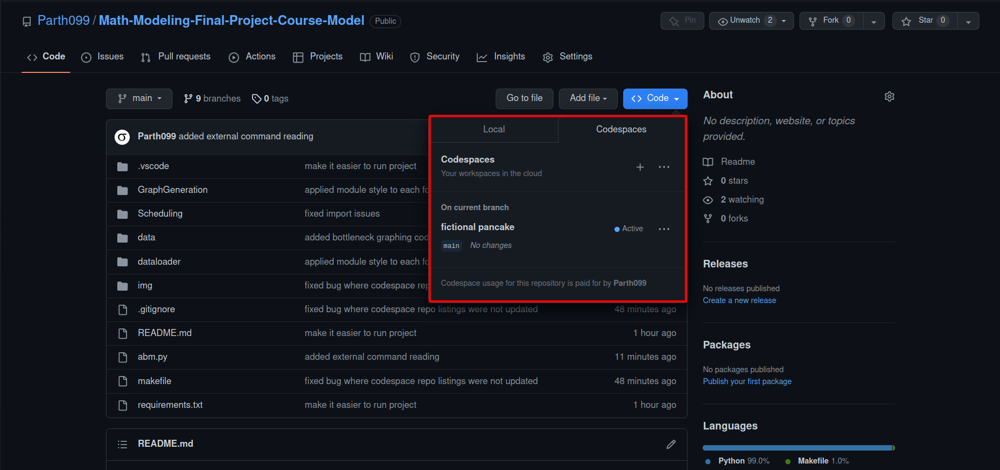

# Math-Modeling-Final-Project-Course-Model

> This is the repo to hold my final project for MATH2111: Mathematical Modeling

## Running the project in `Github Codespaces`

Since we are on a containerized code space, not much has to be installed for this project to run.

### Getting on Codespaces

1. Go to the [Repo](https://github.com/Parth099/Math-Modeling-Final-Project-Course-Model)
2. 
3. You can create a new codespace or enter once of the existing code spaces.
4. Thats it! You can now move to the next section in the readme!

### Installing Dependencies

> Each command below must be pased in the terminal.

I have aliased the following command to generate a dependency list and install it:

When it asks `[Y/n]` select `Y` for `yes`. When applications need space they will prompt you.

```shell
make install-deps
```

### Running the project

The project can be ran via

```shell
make run
```

You can edit the code in `abm.py` to run it with alternate settings.

### Running the project with Arguments

#### History Based Grading

You can alter initial conditions via command line arguments:

If you use the `-h` or `--history` flags like below, it will activate history based grading which is not active by default.

```shell
python abm.py -h
```

or

```shell
python abm.py --history
```

#### Changing number of Students

If you use the `-n` or `--num_students` flags like below, it will change the number of students from the default 150 to **125**.

```shell
python abm.py -n 125
```

or

```shell
python abm.py --num_students=125
```

#### Using both

Both arguments can be used via:

```shell
python abm.py -n 125 --h
```
